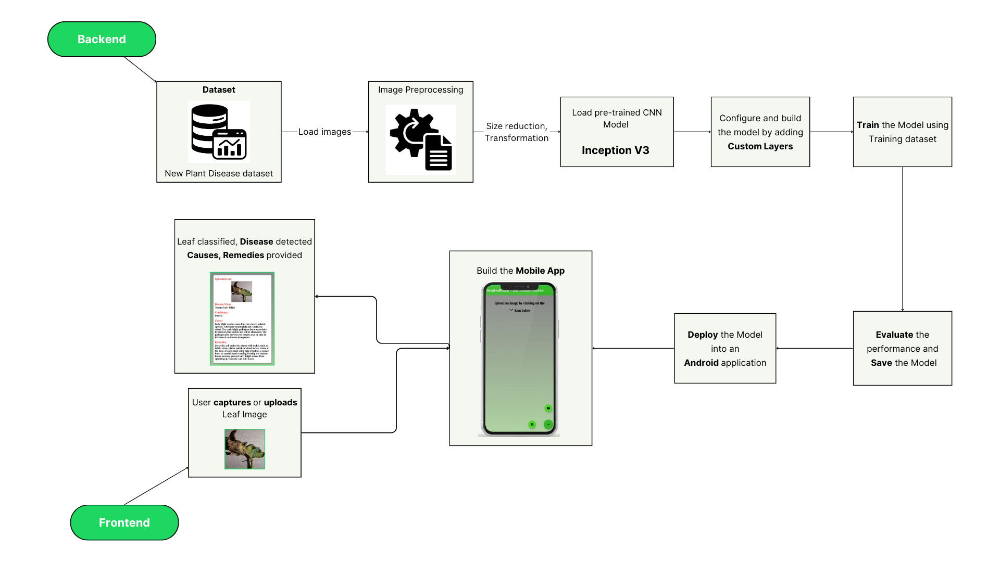
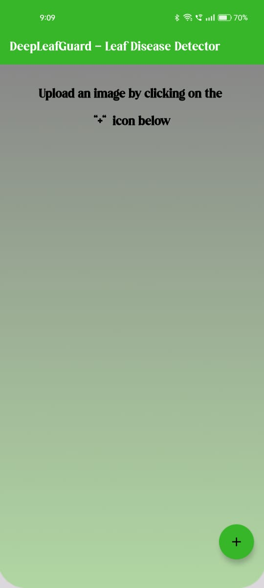
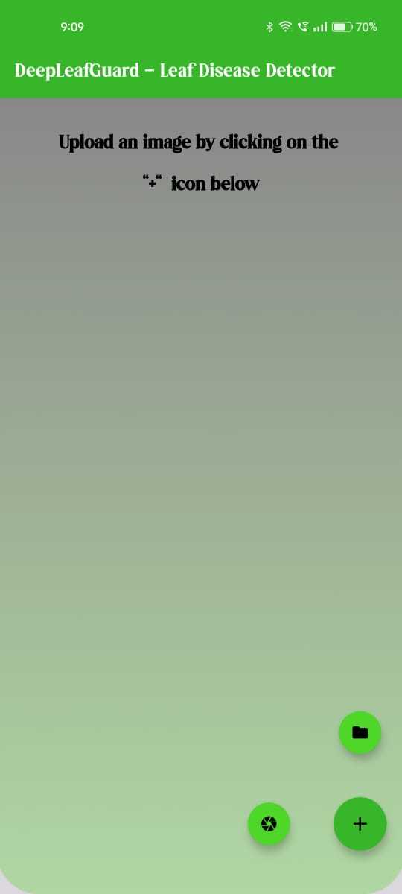
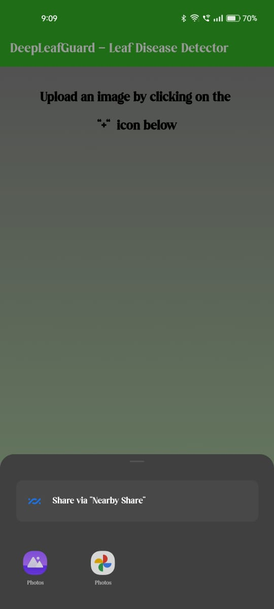
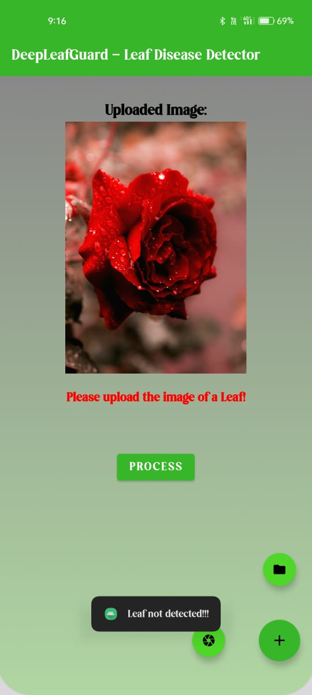
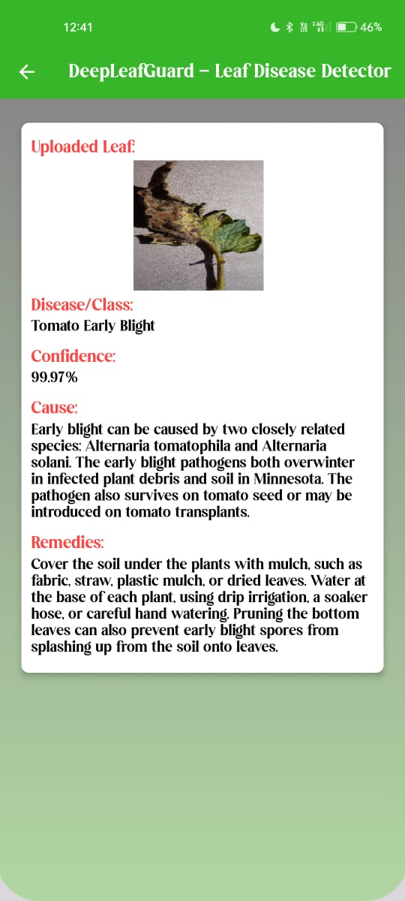
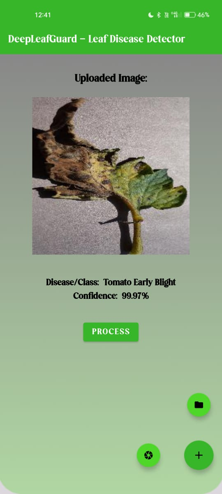

# 🌿 DeepLeafGuard – Leaf Disease Detector

**DeepLeafGuard** is an intelligent Android application designed to detect plant leaf diseases using Deep Learning techniques. The app empowers farmers, agriculturists, and plant lovers to identify crop diseases early and take preventive measures to reduce yield loss.

## 🧩 Problem Statement

In agriculture, the delayed detection of plant leaf diseases leads to significant crop loss. With 98% of plant damage caused by pathogens, early diagnosis and remediation are crucial. Environmental factors, infections, and human errors in pesticide application worsen the problem. This project offers a mobile-based solution that uses computer vision and deep learning to detect and suggest remedies for leaf diseases in real time.

---

## ✅ Features

- 📸 Upload leaf image or click using phone camera
- 🔍 Detect plant diseases using trained InceptionV3 model
- 🧠 Predict the disease with confidence percentage
- 📚 Display cause and recommended remedies
- 📱 Deploy the model into a user-friendly Android app
- 📈 Achieved **99.97% accuracy**

---

## 📦 Dataset

- **Source**: [New Plant Disease Dataset (Kaggle)](https://www.kaggle.com/datasets/vipoooool/new-plant-diseases-dataset)
- **Images**: ~87,000 RGB leaf images (healthy + diseased)
- **Classes**: 38 plant disease types
- **Split Ratio**: 80% training, 20% validation
- **Test Set**: 33 unseen leaf images for final prediction

---

## 🛠️ Tech Stack

| Component       | Description                                                                 |
|----------------|-----------------------------------------------------------------------------|
| 🧠 Model        | Inception V3 (Transfer Learning with customized Dense layers)               |
| 📊 Frameworks   | TensorFlow, Keras                                                           |
| 📱 Frontend     | Android Studio, Java                                                        |
| 🛢️ Backend      | Python for model training, Android ML Kit integration                       |
| 🧪 Evaluation   | Accuracy, Precision, Recall, F1-score                                        |
| 🧾 Format       | H5 model export for mobile integration                                      |

---

## 📌 Workflow Diagram

---

## 🧮 Model Pipeline (Summary)

1. **Load Dataset**  
2. **Image Preprocessing** (Resizing, Normalization)  
3. **Load Pretrained InceptionV3**  
4. **Freeze base layers**  
5. **Add Custom Layers** (Dense, Dropout)  
6. **Compile & Train Model** with early stopping  
7. **Evaluate** (Accuracy: 99.97%)  
8. **Deploy** in Android Application  
9. **Detect → Diagnose → Prescribe Remedies**

---

## 📱 Mobile App Screenshots

### 🏠 Welcome Screen

---

### 📤 Upload Image Screen

---

### ➕ Upload via Camera/Gallery

  

---

### ❌ Invalid Image (Not a Leaf)

---

### ✅ Detected Disease with Remedies

  

---

## 📈 Evaluation Metrics

| Metric        | Score     |
|---------------|-----------|
| Accuracy      | 99.97%    |
| Precision     | 99.97%    |
| Recall        | 99.97%    |
| F1-Score      | 99.97%    |

> Evaluated on a validation set of 17,572 samples.

---

## 🔮 Future Enhancements

- 🐛 Add more diseases and pest recognition  
- 📡 Real-time monitoring using IoT  
- 🔔 Auto alerts and notifications  
- 📍 Geo-location-based disease trends  

---

## 👩‍💻 Authors

- **Prathyusha Sudhabathula** 

## 🙏 Acknowledgments

- Kaggle Datasets  
- TensorFlow & Keras Documentation  
- Android ML Integration Resources  
